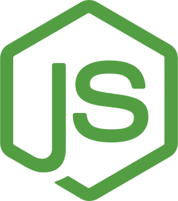

### Hi there 👋

📍 Hailing from Morocco, I'm a dedicated Full Stack Developer with a passion for creating innovative and engaging web applications.

🔧 Proficient in:

<a href="https://reactjs.org/" target="_blank" title="React">
<a href="https://nodejs.org/en/" target="_blank" title="Node.js">
<a href="https://www.typescriptlang.org/" target="_blank" title="Typescript">
<a href="https://www.python.org/" target="_blank" title="Python">
<a href="https://www.mongodb.com/" target="_blank" title="MongoDB">

🌐 Building seamless user experiences and leveraging the power of modern technologies to bring ideas to life.

🎮 When I'm not programming, I enjoy watching animes and playing video games.

Let's connect and create something amazing together!
